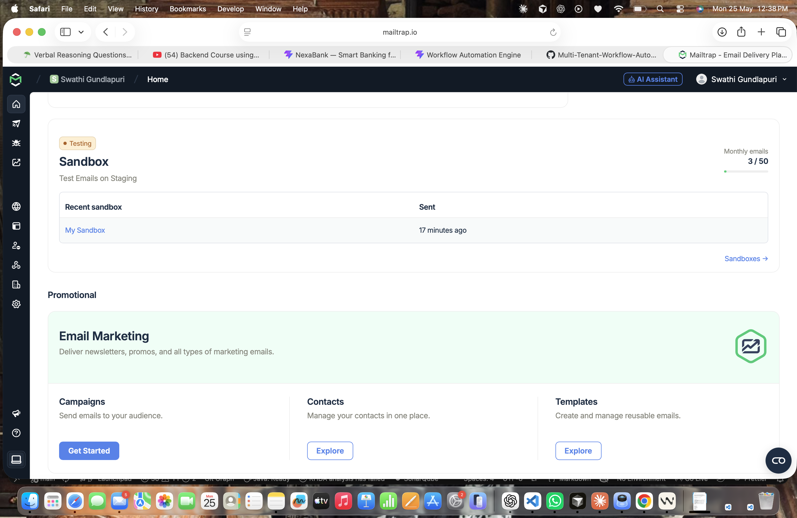

# FlowForge — Multi-Tenant Workflow Automation Engine

A full-stack **SaaS platform** that enables organizations to automate their business workflows. Built with **React.js + Spring Boot**, it supports multi-tenant architecture where each organization gets their own isolated workspace.

---

## 🚀 Live Demo
> Coming Soon (Deployment in progress)

---

## 📌 Features

- 🏢 **Multi-Tenant Architecture** — Each organization gets its own isolated workspace
- ⚡ **Workflow Automation** — Create and manage automated workflows with triggers and actions
- 📊 **Real-Time Dashboard** — Track executions, success rates, and team activity
- 👥 **User Management** — Invite and manage team members within workspaces
- 📧 **Email Notifications** — Automated email alerts on workflow execution via Mailtrap

## 📧 Email Notification Demo



- 🔐 **JWT Authentication** — Secure login and session management
- 📈 **Execution History** — View logs and history of all workflow runs

---

## 🛠️ Tech Stack

### Frontend
- React.js + Vite
- Tailwind CSS
- Recharts (Analytics)
- React Query
- Wouter (Routing)

### Backend
- Java 17
- Spring Boot 3.2
- Spring Security
- Spring Data JPA
- JWT Authentication

### Database
- PostgreSQL

### Email
- Mailtrap SMTP (Testing)
- JavaMailSender

---

## 📁 Project Structure

```
Multi-Tenant-Workflow-Automation-Engine/
├── artifacts/
│   ├── api-server/          # Spring Boot Backend
│   │   ├── src/main/java/com/flowforge/
│   │   │   ├── controller/  # REST API Controllers
│   │   │   ├── service/     # Business Logic
│   │   │   ├── entity/      # JPA Entities
│   │   │   ├── repository/  # Spring Data Repositories
│   │   │   ├── security/    # JWT & Spring Security
│   │   │   └── dto/         # Data Transfer Objects
│   │   └── resources/
│   │       └── application.properties
│   └── web/                 # React Frontend
│       └── src/
│           ├── components/  # Reusable UI Components
│           └── pages/       # Page Components
```

---

## ⚙️ Setup Instructions

### Prerequisites
- Java 17+
- Node.js 18+
- PostgreSQL
- Maven
- pnpm

### Backend Setup

1. **Clone the repository:**
```bash
git clone https://github.com/Gundlapuriswathiii006/Multi-Tenant-Workflow-Automation-Engine-SaaS-Platform.git
cd Multi-Tenant-Workflow-Automation-Engine-SaaS-Platform
```

2. **Configure PostgreSQL in `application.properties`:**
```properties
spring.datasource.url=jdbc:postgresql://localhost:5432/flowforge
spring.datasource.username=your_username
spring.datasource.password=your_password
```

3. **Run Spring Boot backend:**
```bash
cd artifacts/api-server
mvn spring-boot:run
```

### Frontend Setup

1. **Install dependencies:**
```bash
pnpm install
```

2. **Run React frontend:**
```bash
pnpm --filter @workspace/web run dev
```

3. **Open browser:**
```
http://localhost:5173
```

---

## 📡 API Endpoints

| Method | Endpoint | Description |
|--------|----------|-------------|
| POST | `/api/auth/register` | Register new workspace |
| POST | `/api/auth/login` | Login to workspace |
| GET | `/api/workflows` | Get all workflows |
| POST | `/api/workflows` | Create new workflow |
| POST | `/api/workflows/{id}/trigger` | Execute workflow |
| GET | `/api/executions` | Get execution history |
| GET | `/api/dashboard` | Get dashboard stats |

---

## 📧 Email Notification Flow

1. User creates a workflow
2. User triggers the workflow manually
3. Spring Boot executes all workflow actions
4. **EmailService sends notification** via Mailtrap SMTP
5. Email arrives in Mailtrap sandbox inbox

---

## 🔐 Environment Variables

```properties
# Database
PGHOST=localhost
PGPORT=5432
PGDATABASE=flowforge
PGUSER=postgres
PGPASSWORD=your_password

# JWT
SESSION_SECRET=your_secret_key

# Mail
spring.mail.host=sandbox.smtp.mailtrap.io
spring.mail.port=2525
spring.mail.username=your_mailtrap_username
spring.mail.password=your_mailtrap_password
```

---

## 👩‍💻 Developer

**Gundlapuri Swathi**
- GitHub: [@Gundlapuriswathiii006](https://github.com/Gundlapuriswathiii006)
- LinkedIn: [gundlapuri-swathi](https://linkedin.com/in/gundlapuri-swathi-b436a1356)

---

## 📄 License
MIT License
